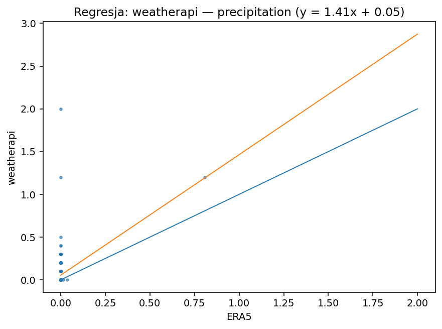
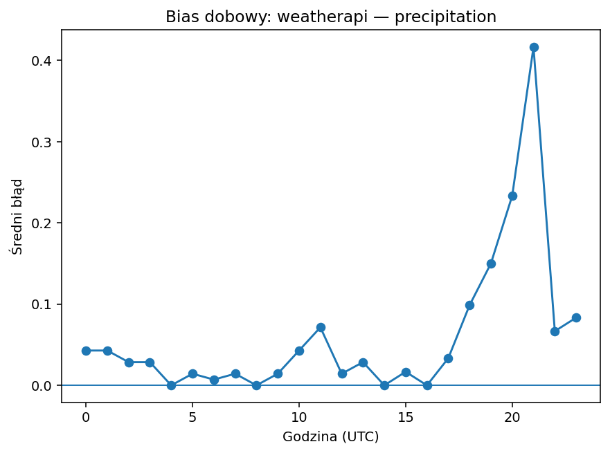
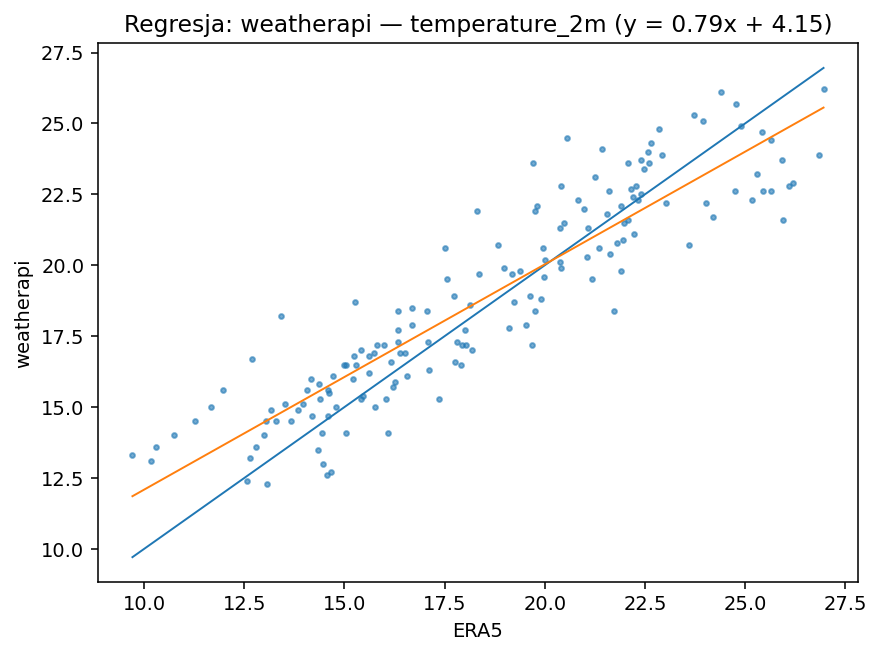
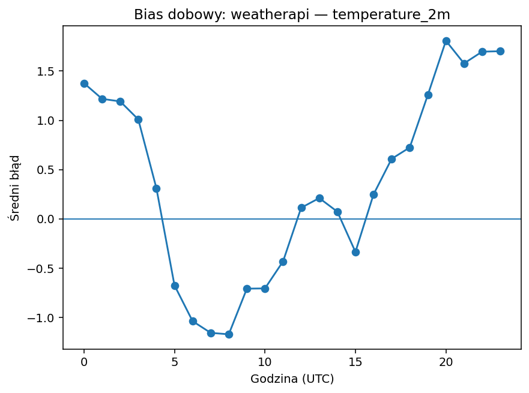
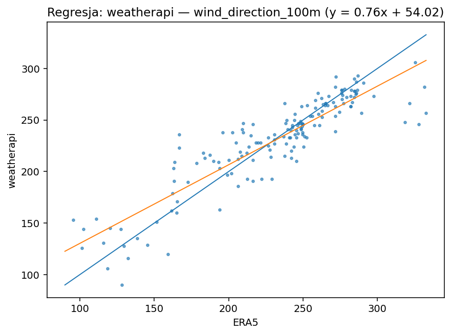
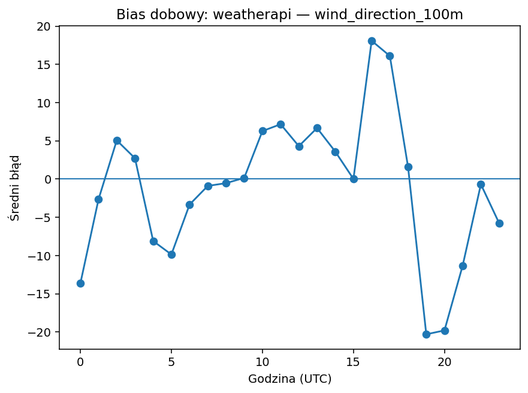
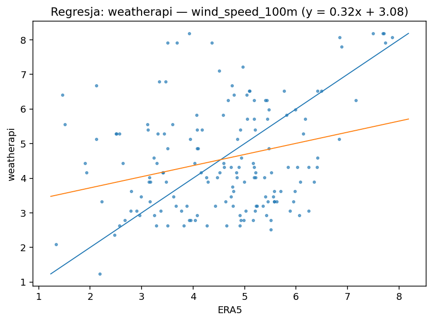
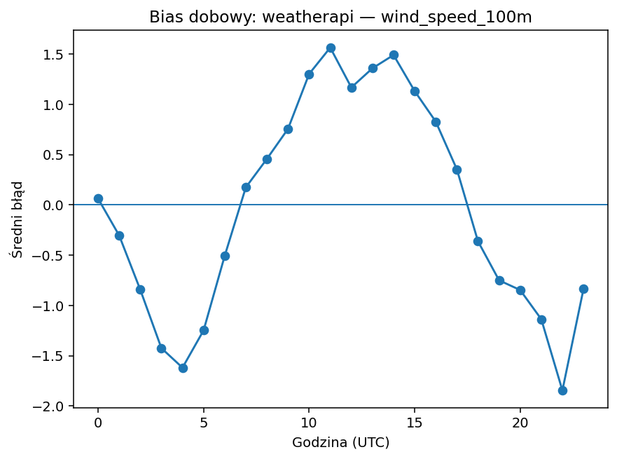

# weatherapi

| variable | pokrycie% | dorobione% | bias | MAE | RMSE | slope | intercept | R2 | diurnal_amp | diurnal_peak_hour |
|---|---|---|---|---|---|---|---|---|---|---|
| precipitation | 94.643 | 0.000 | 0.057 | 0.057 | 0.211 | 1.410 | 0.055 | 0.167 | 0.417 | 21 |
| temperature_2m | 94.643 | 0.000 | 0.334 | 1.424 | 1.753 | 0.794 | 4.145 | 0.826 | 2.980 | 20 |
| wind_direction_100m | 94.643 | 0.000 | -0.963 | 15.994 | 22.599 | 0.763 | 54.015 | 0.800 | 38.385 | 19 |
| wind_speed_100m | 94.643 | 0.000 | -0.025 | 1.419 | 1.764 | 0.322 | 3.079 | 0.078 | 3.412 | 22 |

## precipitation

Bias +0.06 (zawyża). Skala/offset: slope=1.41, intercept=0.05, R²=0.17. Wzorzec dobowy: amplituda 0.42, pik ok. godz. 21. Opad: POD=1.00, FAR=0.95, CSI=0.05 (próg 0.1 mm/h).

## temperature_2m

Bias +0.33 (zawyża). Skala/offset: slope=0.79, intercept=4.15, R²=0.83. Wzorzec dobowy: amplituda 2.98, pik ok. godz. 20.

## wind_direction_100m

Bias -0.96 (zaniża). Skala/offset: slope=0.76, intercept=54.02, R²=0.80. Wzorzec dobowy: amplituda 38.38, pik ok. godz. 19.

## wind_speed_100m

Bias -0.02 (zaniża). Skala/offset: slope=0.32, intercept=3.08, R²=0.08. Wzorzec dobowy: amplituda 3.41, pik ok. godz. 22.

