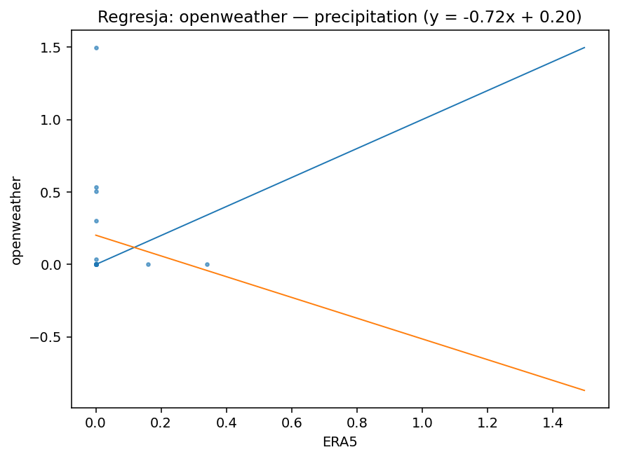
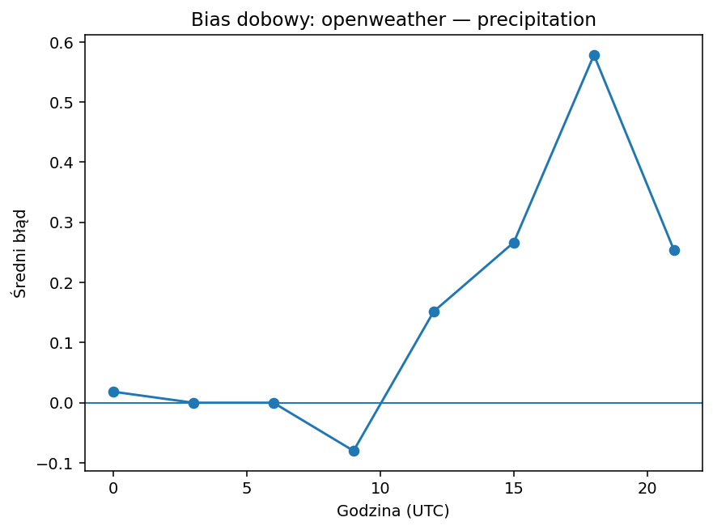
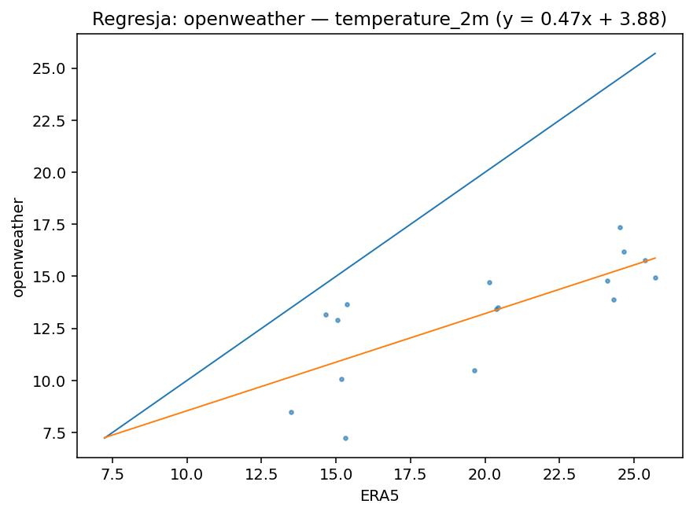
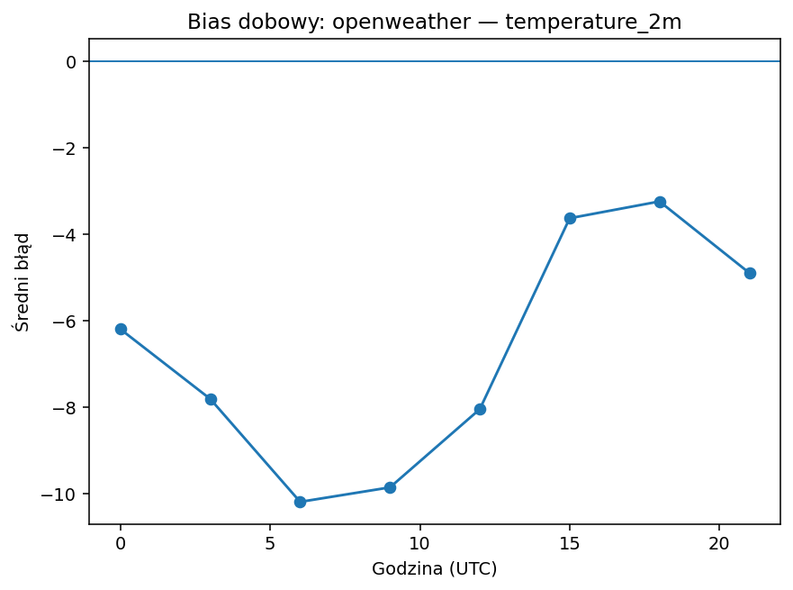
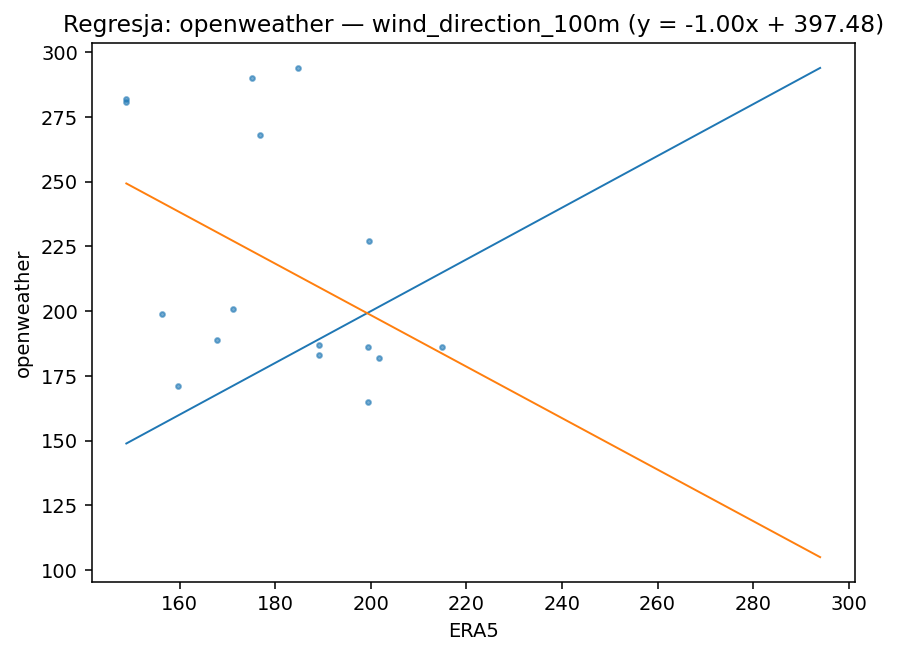
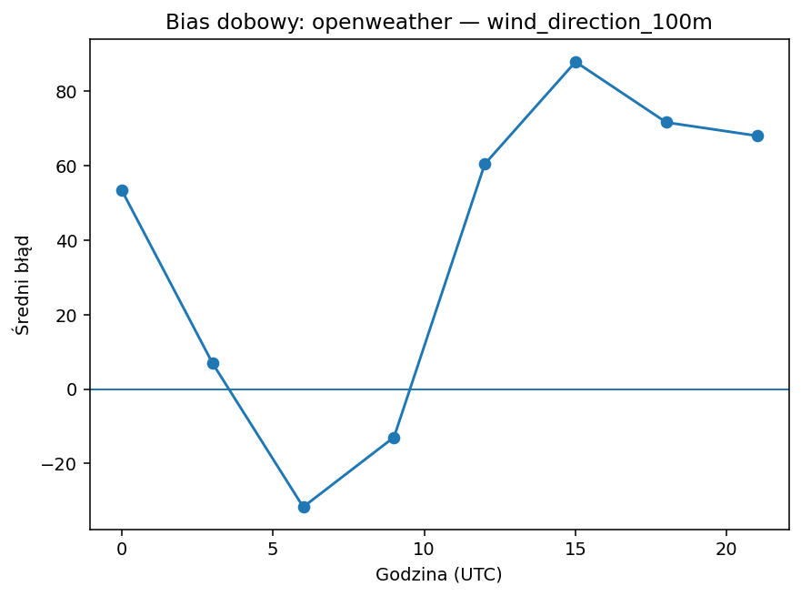
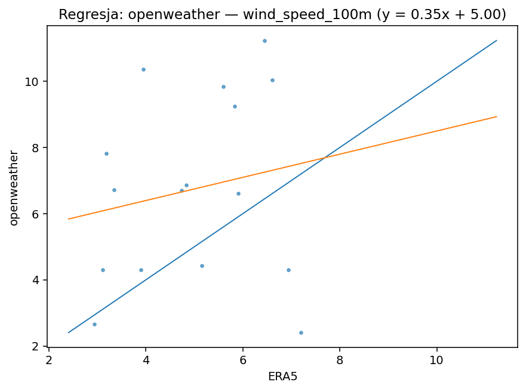
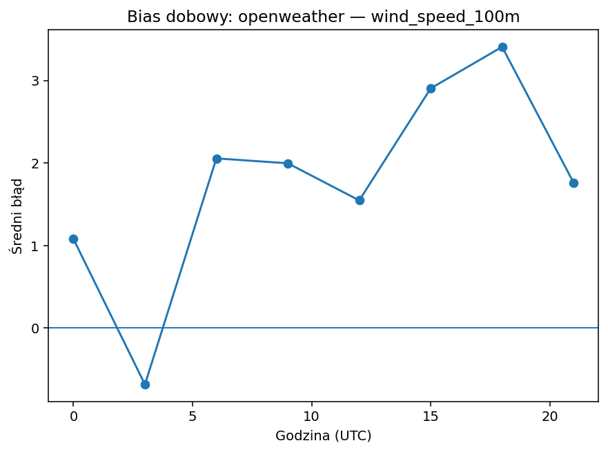

# openweather

| variable | pokrycie% | dorobione% | bias | MAE | RMSE | slope | intercept | R2 | diurnal_amp | diurnal_peak_hour |
|---|---|---|---|---|---|---|---|---|---|---|
| precipitation | 100.000 | 0.000 | 0.149 | 0.211 | 0.434 | -0.716 | 0.202 | 0.027 | 0.658 | 18 |
| temperature_2m | 100.000 | 0.000 | -6.733 | 6.733 | 7.340 | 0.467 | 3.877 | 0.563 | 6.947 | 6 |
| wind_direction_100m | 100.000 | 0.000 | 38.006 | 51.109 | 68.597 | -0.995 | 397.475 | 0.182 | 119.639 | 15 |
| wind_speed_100m | 100.000 | 0.000 | 1.759 | 2.811 | 3.342 | 0.350 | 4.995 | 0.032 | 4.092 | 18 |

## precipitation

Bias +0.15 (zawyża). Skala/offset: slope=-0.72, intercept=0.20, R²=0.03. Wzorzec dobowy: amplituda 0.66, pik ok. godz. 18. Opad: POD=0.00, FAR=1.00, CSI=0.00 (próg 0.1 mm/h).

## temperature_2m

Bias -6.73 (zaniża). Skala/offset: slope=0.47, intercept=3.88, R²=0.56. Wzorzec dobowy: amplituda 6.95, pik ok. godz. 6.

## wind_direction_100m

Bias +38.01 (zawyża). Skala/offset: slope=-1.00, intercept=397.48, R²=0.18. Wzorzec dobowy: amplituda 119.64, pik ok. godz. 15.

## wind_speed_100m

Bias +1.76 (zawyża). Skala/offset: slope=0.35, intercept=5.00, R²=0.03. Wzorzec dobowy: amplituda 4.09, pik ok. godz. 18.

