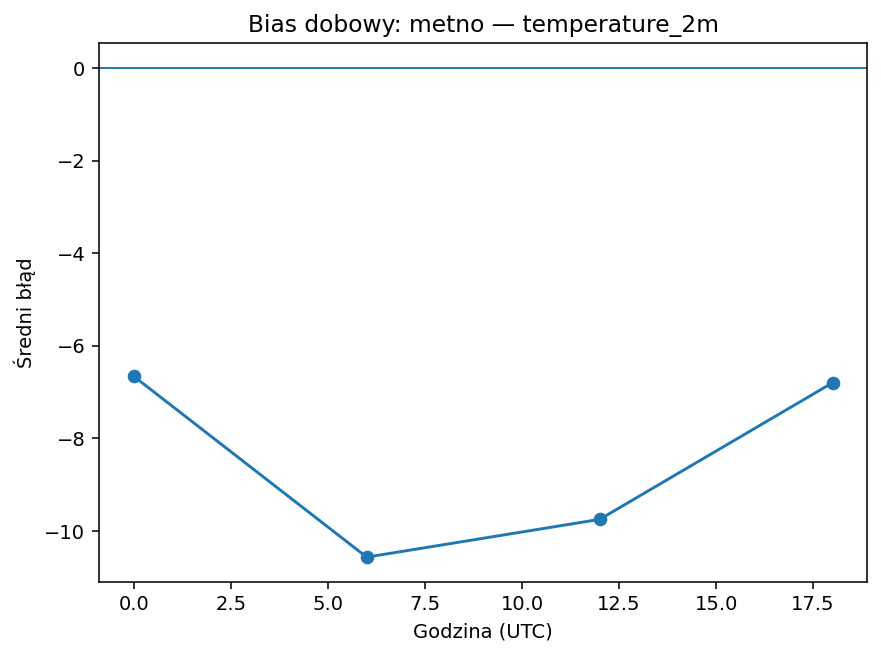

# metno

| variable | pokrycie% | dorobione% | bias | MAE | RMSE | slope | intercept | R2 | diurnal_amp | diurnal_peak_hour |
|---|---|---|---|---|---|---|---|---|---|---|
| temperature_2m | 100.000 | 0.000 | -8.443 | 8.443 | 8.681 | 0.664 | -1.697 | 0.796 | 3.905 | 6 |
| wind_direction_100m | 100.000 | 0.000 | 74.590 | 92.077 | 103.873 | -2.088 | 623.874 | 0.611 | 166.520 | 18 |
| wind_speed_100m | 100.000 | 0.000 | -1.667 | 2.360 | 2.574 | -0.034 | 3.562 | 0.002 | 3.674 | 0 |

## temperature_2m

Bias -8.44 (zaniża). Skala/offset: slope=0.66, intercept=-1.70, R²=0.80. Wzorzec dobowy: amplituda 3.90, pik ok. godz. 6.

## wind_direction_100m

Bias +74.59 (zawyża). Skala/offset: slope=-2.09, intercept=623.87, R²=0.61. Wzorzec dobowy: amplituda 166.52, pik ok. godz. 18.

## wind_speed_100m

Bias -1.67 (zaniża). Skala/offset: slope=-0.03, intercept=3.56, R²=0.00. Wzorzec dobowy: amplituda 3.67, pik ok. godz. 0.

