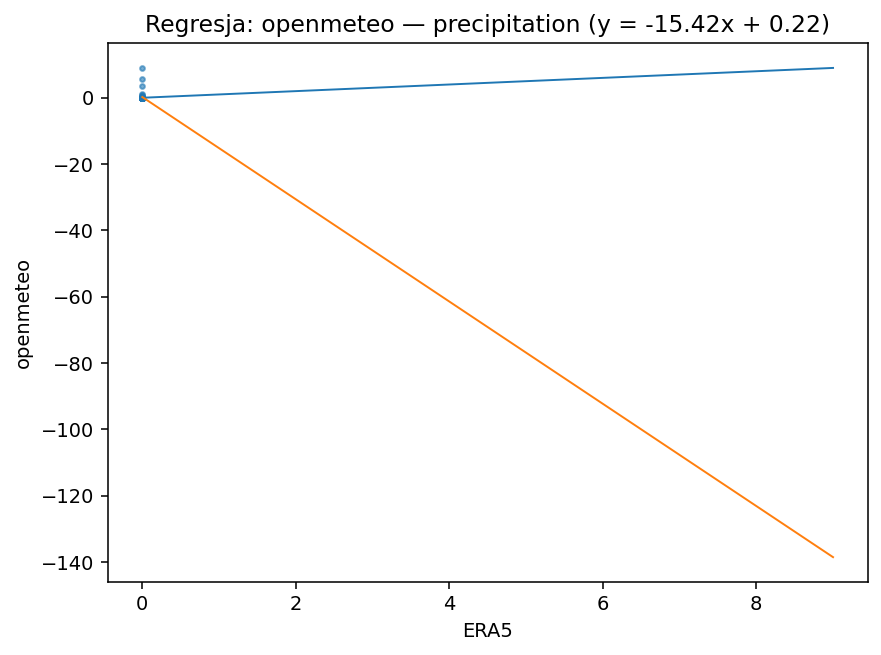
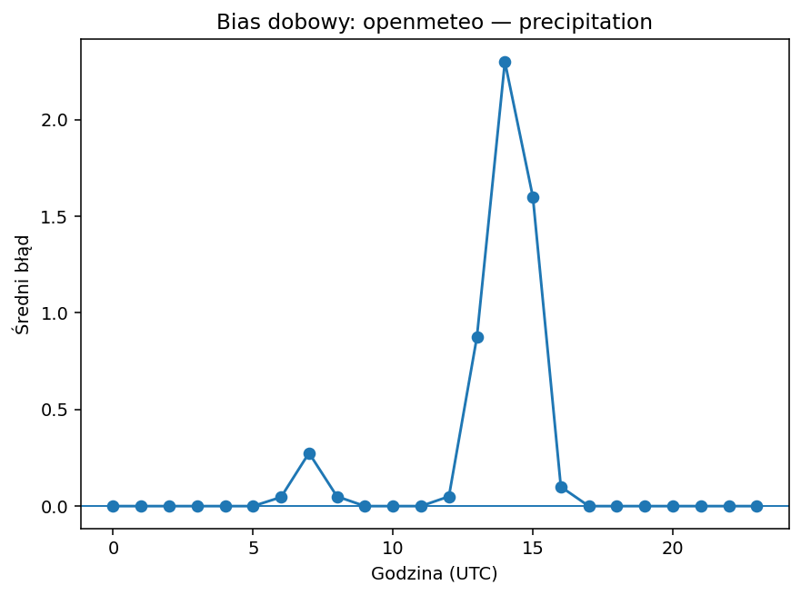
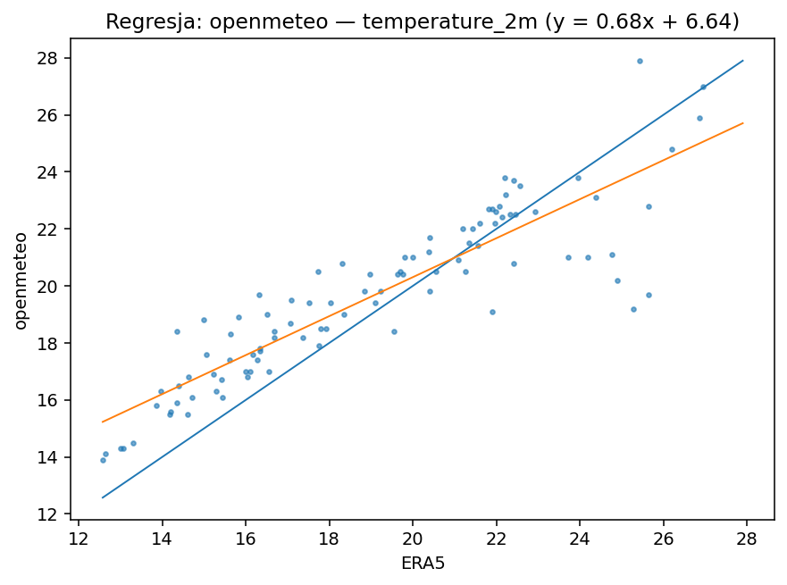
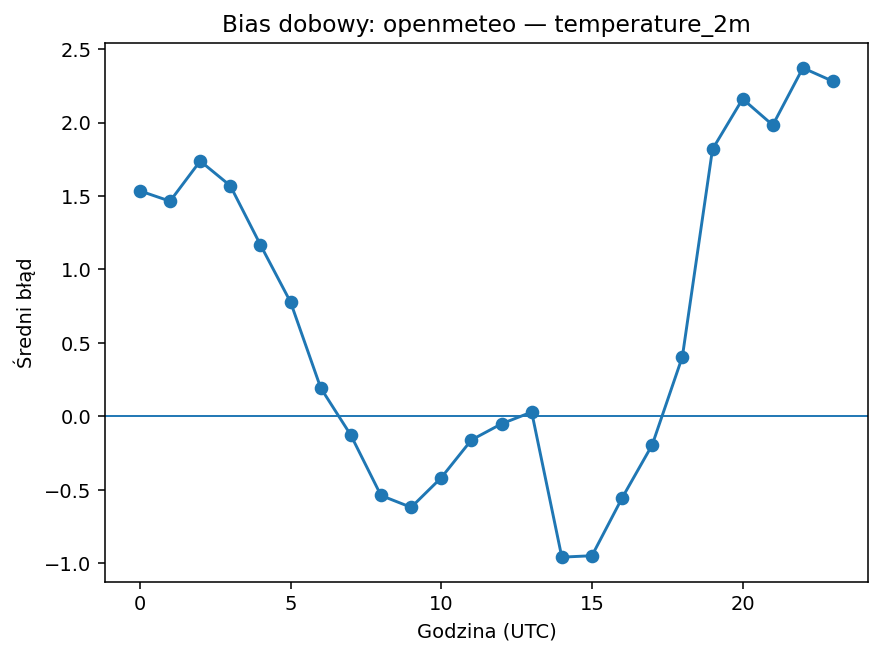
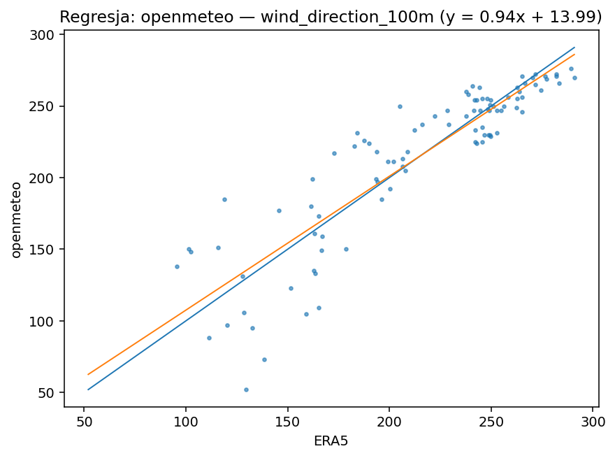
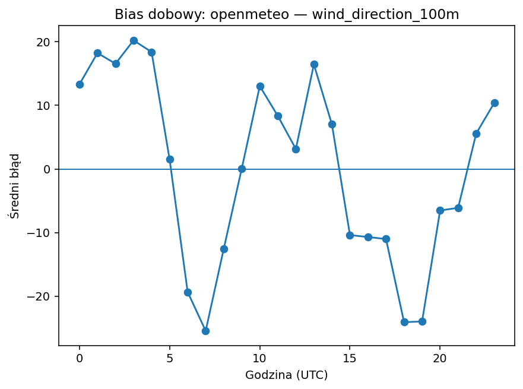
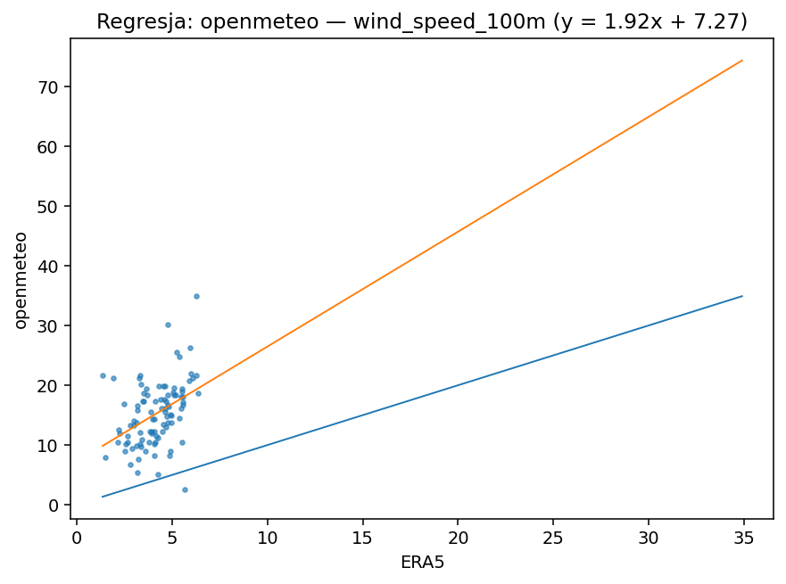
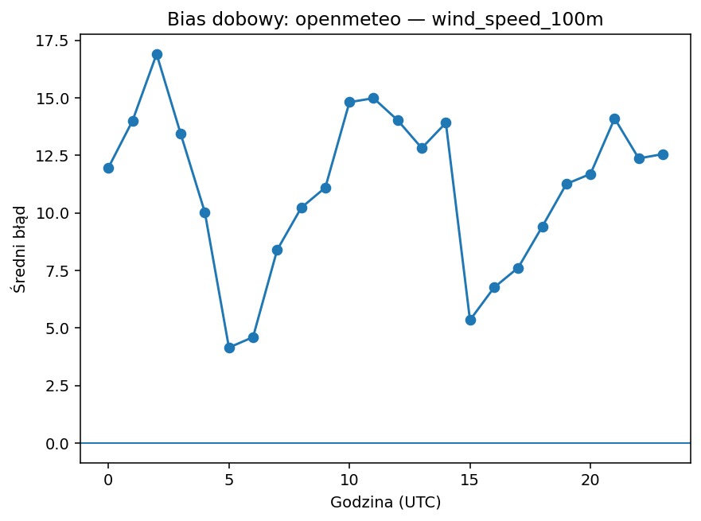

# openmeteo

| variable | pokrycie% | dorobione% | bias | MAE | RMSE | slope | intercept | R2 | diurnal_amp | diurnal_peak_hour |
|---|---|---|---|---|---|---|---|---|---|---|
| precipitation | 100.000 | 0.000 | 0.221 | 0.221 | 1.149 | -15.424 | 0.223 | 0.000 | 2.300 | 14 |
| temperature_2m | 100.000 | 0.000 | 0.622 | 1.467 | 1.877 | 0.683 | 6.637 | 0.792 | 3.329 | 22 |
| wind_direction_100m | 100.000 | 0.000 | 0.086 | 18.503 | 24.736 | 0.935 | 13.995 | 0.794 | 45.698 | 7 |
| wind_speed_100m | 100.000 | 0.000 | 11.104 | 11.169 | 12.173 | 1.921 | 7.274 | 0.167 | 12.749 | 2 |

## precipitation

Bias +0.22 (zawyża). Skala/offset: slope=-15.42, intercept=0.22, R²=0.00. Wzorzec dobowy: amplituda 2.30, pik ok. godz. 14.

## temperature_2m

Bias +0.62 (zawyża). Skala/offset: slope=0.68, intercept=6.64, R²=0.79. Wzorzec dobowy: amplituda 3.33, pik ok. godz. 22.

## wind_direction_100m

Bias +0.09 (zawyża). Skala/offset: slope=0.94, intercept=13.99, R²=0.79. Wzorzec dobowy: amplituda 45.70, pik ok. godz. 7.

## wind_speed_100m

Bias +11.10 (zawyża). Skala/offset: slope=1.92, intercept=7.27, R²=0.17. Wzorzec dobowy: amplituda 12.75, pik ok. godz. 2.

