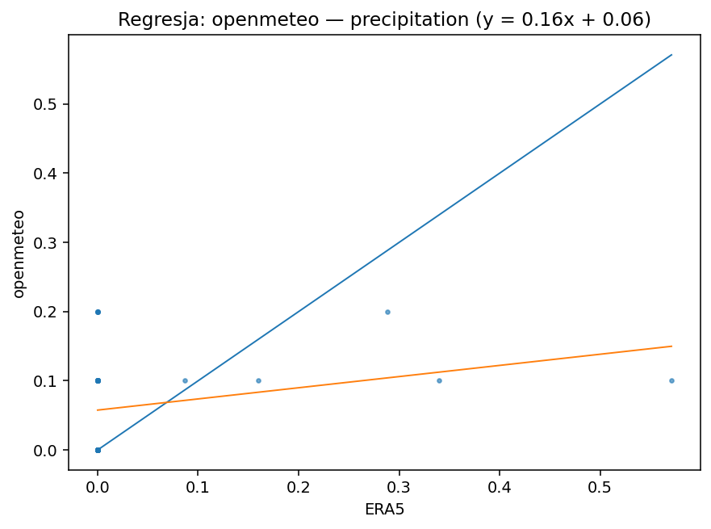
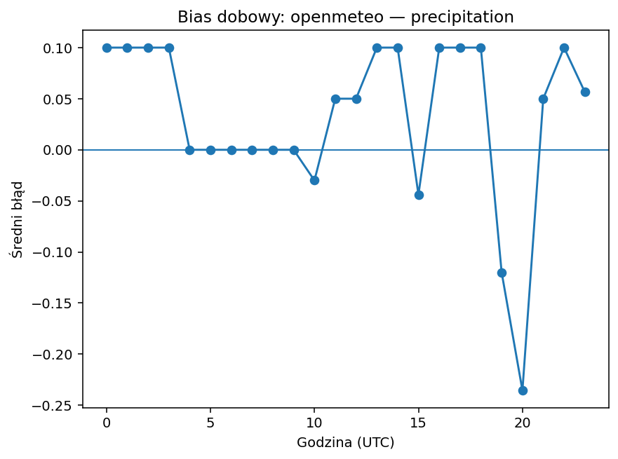
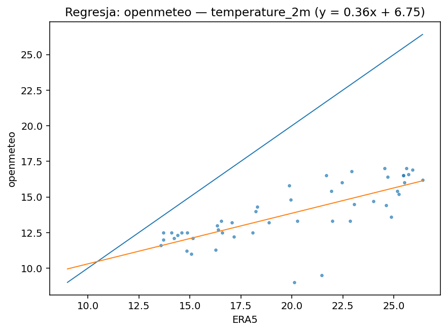
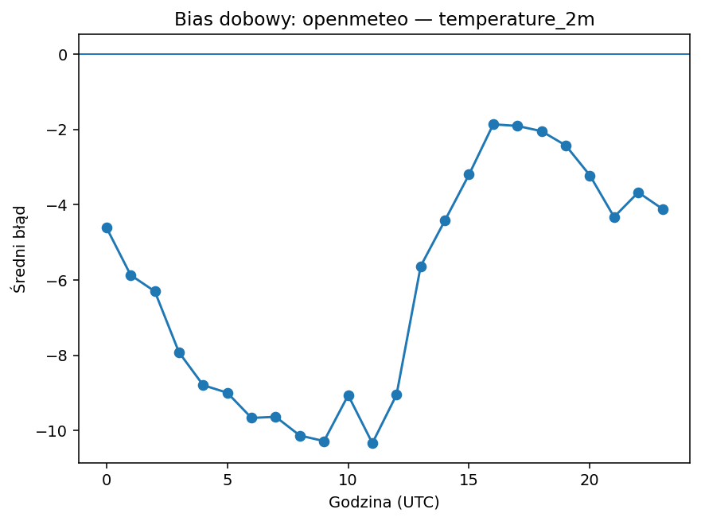
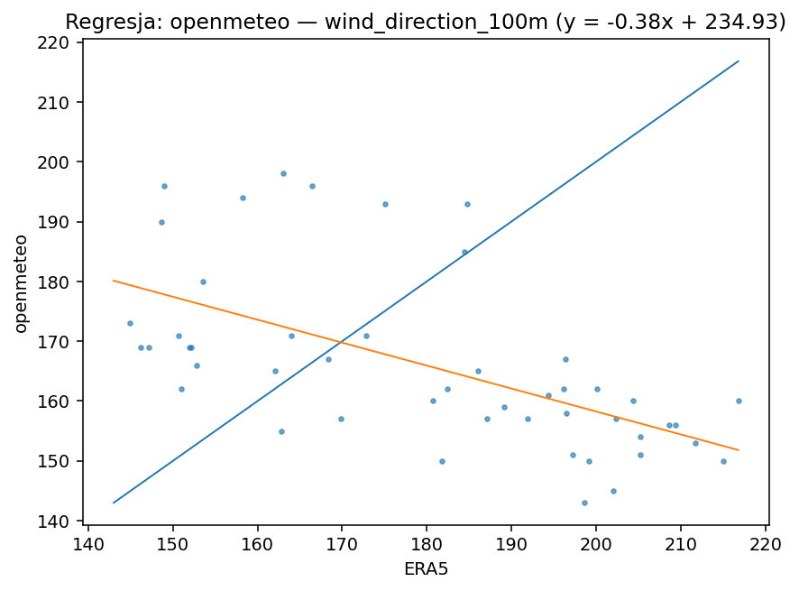
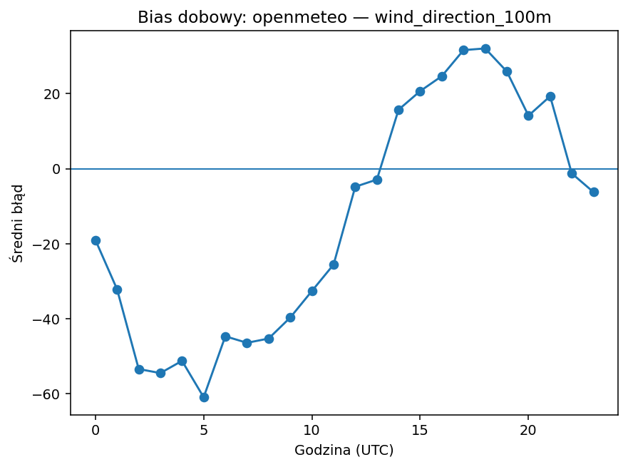
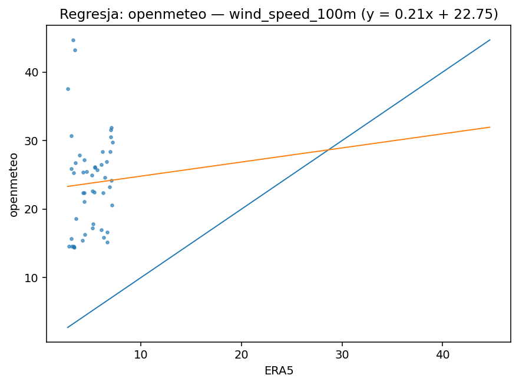
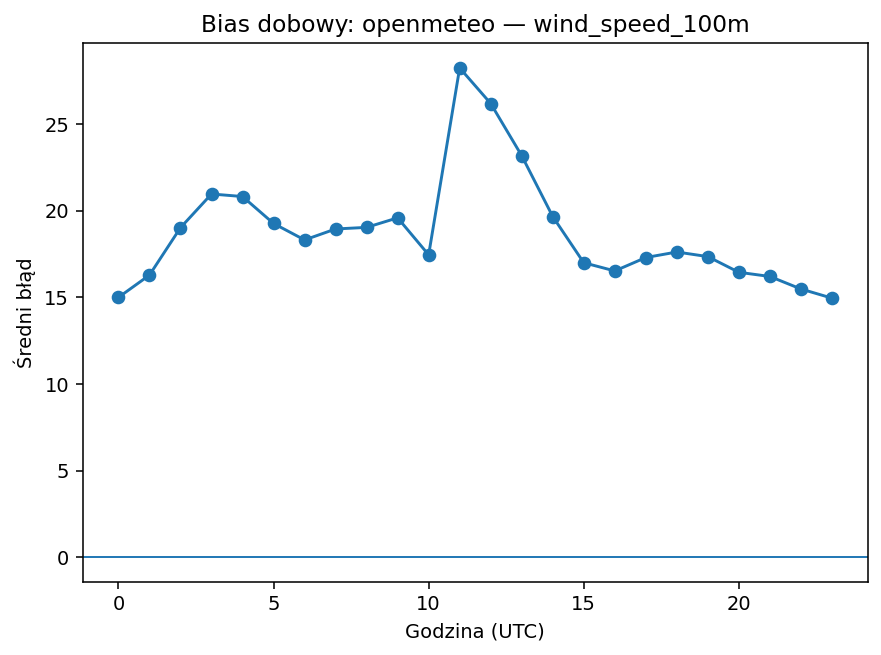

# openmeteo

| variable | pokrycie% | dorobione% | bias | MAE | RMSE | slope | intercept | R2 | diurnal_amp | diurnal_peak_hour |
|---|---|---|---|---|---|---|---|---|---|---|
| precipitation | 66.667 | 0.000 | 0.032 | 0.068 | 0.115 | 0.161 | 0.058 | 0.058 | 0.336 | 20 |
| temperature_2m | 66.667 | 0.000 | -6.146 | 6.146 | 6.870 | 0.355 | 6.748 | 0.553 | 8.467 | 11 |
| wind_direction_100m | 66.667 | 0.000 | -14.021 | 30.815 | 35.404 | -0.383 | 234.934 | 0.347 | 92.966 | 5 |
| wind_speed_100m | 66.667 | 0.000 | 18.788 | 18.788 | 20.092 | 0.206 | 22.755 | 0.002 | 13.293 | 11 |

## precipitation

Bias +0.03 (zawyża). Skala/offset: slope=0.16, intercept=0.06, R²=0.06. Wzorzec dobowy: amplituda 0.34, pik ok. godz. 20. Opad: POD=0.25, FAR=0.83, CSI=0.11 (próg 0.1 mm/h).

## temperature_2m

Bias -6.15 (zaniża). Skala/offset: slope=0.36, intercept=6.75, R²=0.55. Wzorzec dobowy: amplituda 8.47, pik ok. godz. 11.

## wind_direction_100m

Bias -14.02 (zaniża). Skala/offset: slope=-0.38, intercept=234.93, R²=0.35. Wzorzec dobowy: amplituda 92.97, pik ok. godz. 5.

## wind_speed_100m

Bias +18.79 (zawyża). Skala/offset: slope=0.21, intercept=22.75, R²=0.00. Wzorzec dobowy: amplituda 13.29, pik ok. godz. 11.

