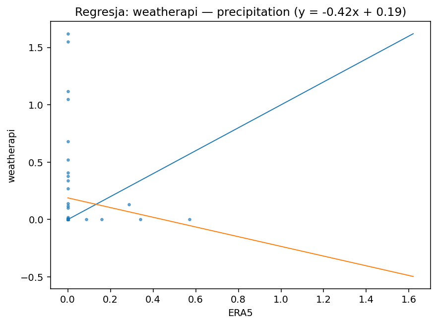
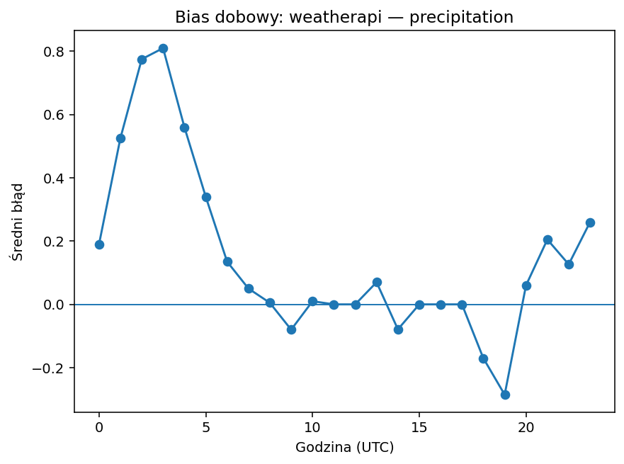
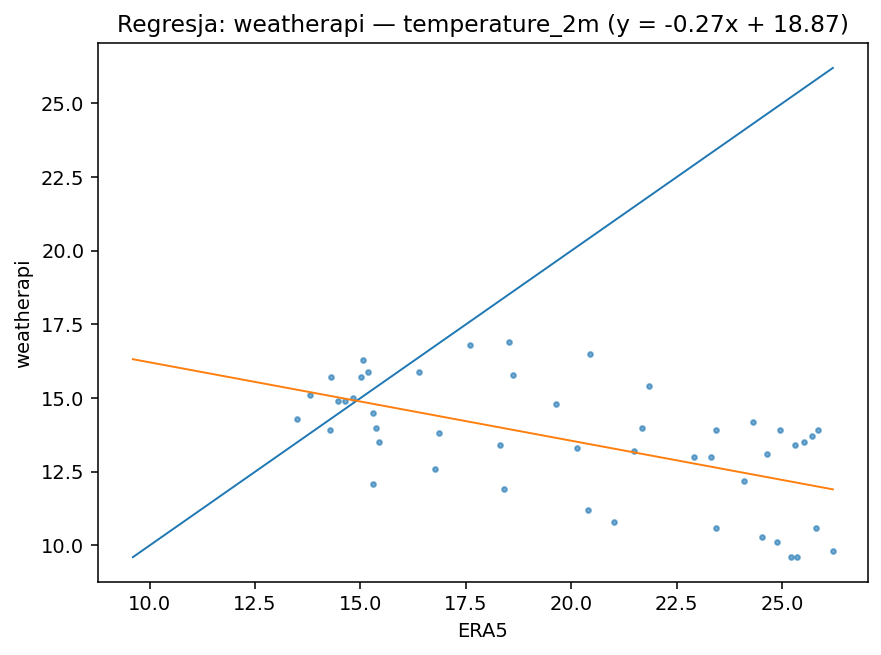
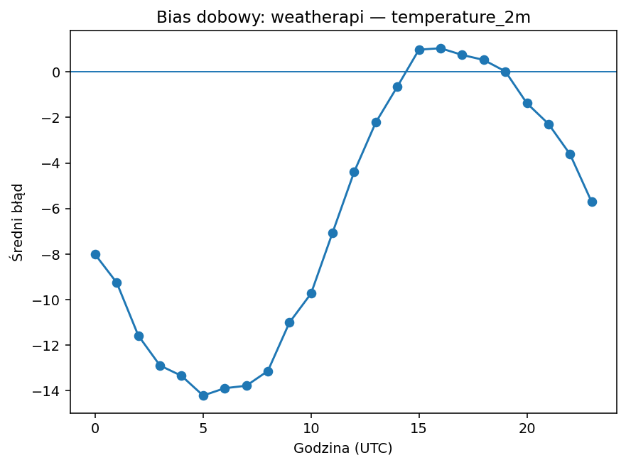
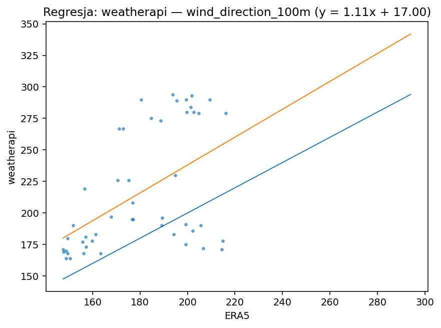
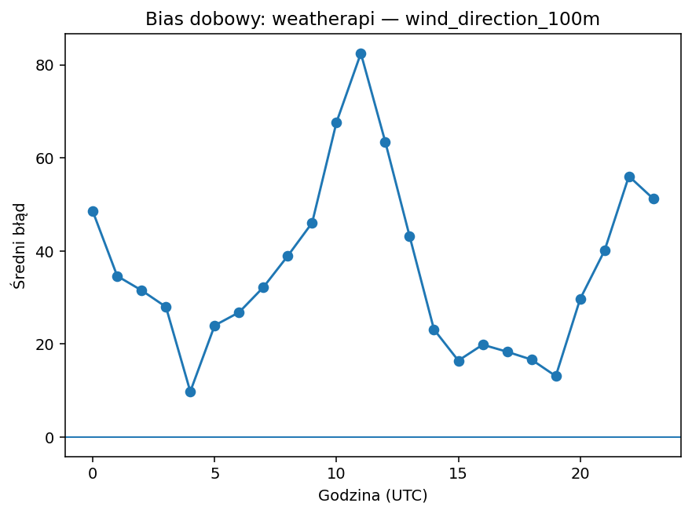
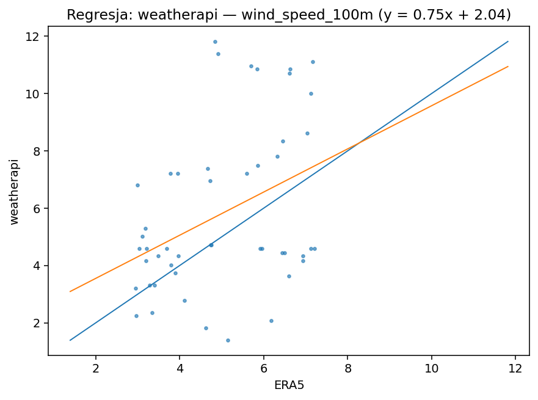
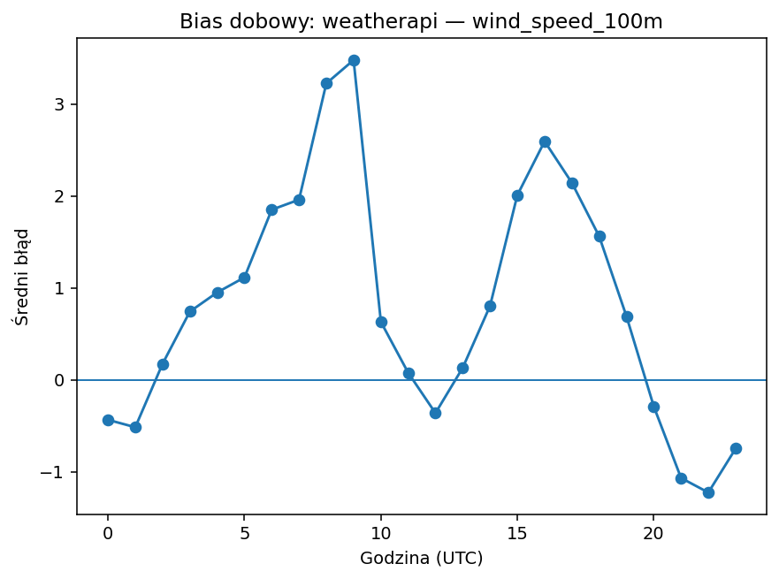

# weatherapi

| variable | pokrycie% | dorobione% | bias | MAE | RMSE | slope | intercept | R2 | diurnal_amp | diurnal_peak_hour |
|---|---|---|---|---|---|---|---|---|---|---|
| precipitation | 100.000 | 0.000 | 0.146 | 0.201 | 0.437 | -0.423 | 0.189 | 0.013 | 1.095 | 3 |
| temperature_2m | 100.000 | 0.000 | -6.450 | 6.742 | 8.563 | -0.266 | 18.873 | 0.332 | 15.252 | 5 |
| wind_direction_100m | 100.000 | 0.000 | 35.917 | 43.842 | 54.326 | 1.105 | 16.998 | 0.260 | 72.656 | 11 |
| wind_speed_100m | 100.000 | 0.000 | 0.810 | 2.235 | 2.778 | 0.753 | 2.045 | 0.147 | 4.704 | 9 |

## precipitation

Bias +0.15 (zawyża). Skala/offset: slope=-0.42, intercept=0.19, R²=0.01. Wzorzec dobowy: amplituda 1.10, pik ok. godz. 3. Opad: POD=0.25, FAR=0.92, CSI=0.06 (próg 0.1 mm/h).

## temperature_2m

Bias -6.45 (zaniża). Skala/offset: slope=-0.27, intercept=18.87, R²=0.33. Wzorzec dobowy: amplituda 15.25, pik ok. godz. 5.

## wind_direction_100m

Bias +35.92 (zawyża). Skala/offset: slope=1.11, intercept=17.00, R²=0.26. Wzorzec dobowy: amplituda 72.66, pik ok. godz. 11.

## wind_speed_100m

Bias +0.81 (zawyża). Skala/offset: slope=0.75, intercept=2.04, R²=0.15. Wzorzec dobowy: amplituda 4.70, pik ok. godz. 9.

