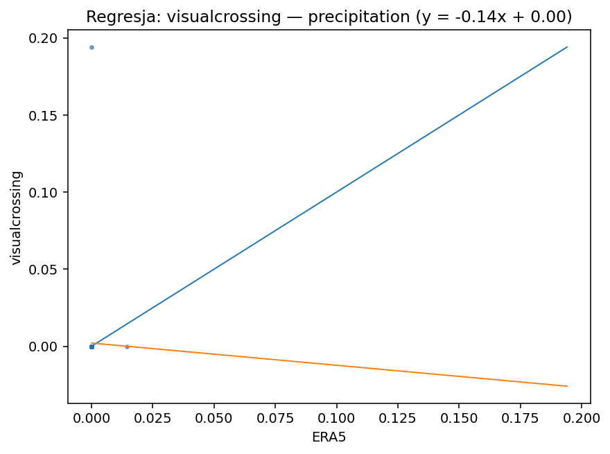
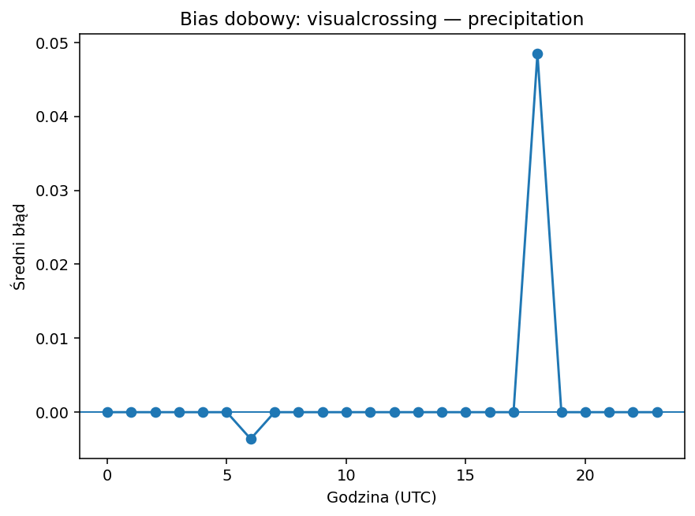
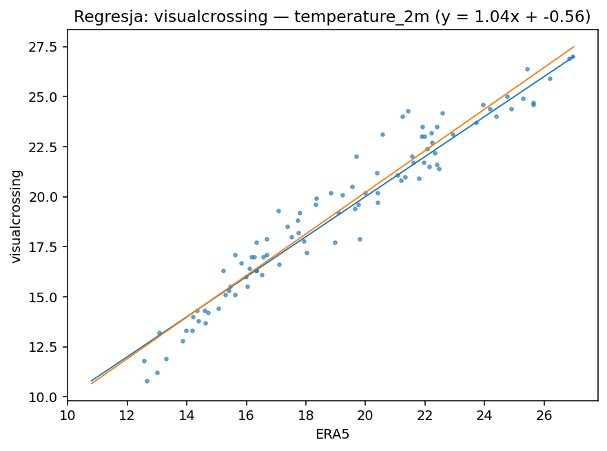
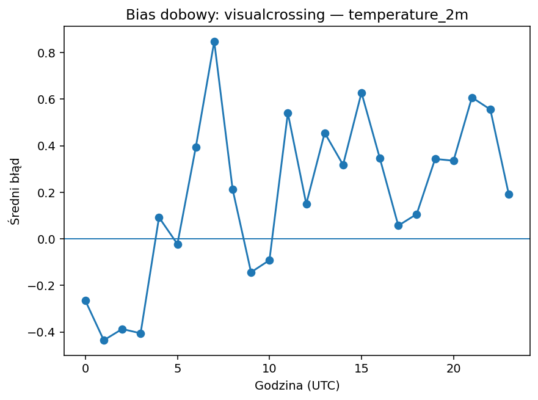
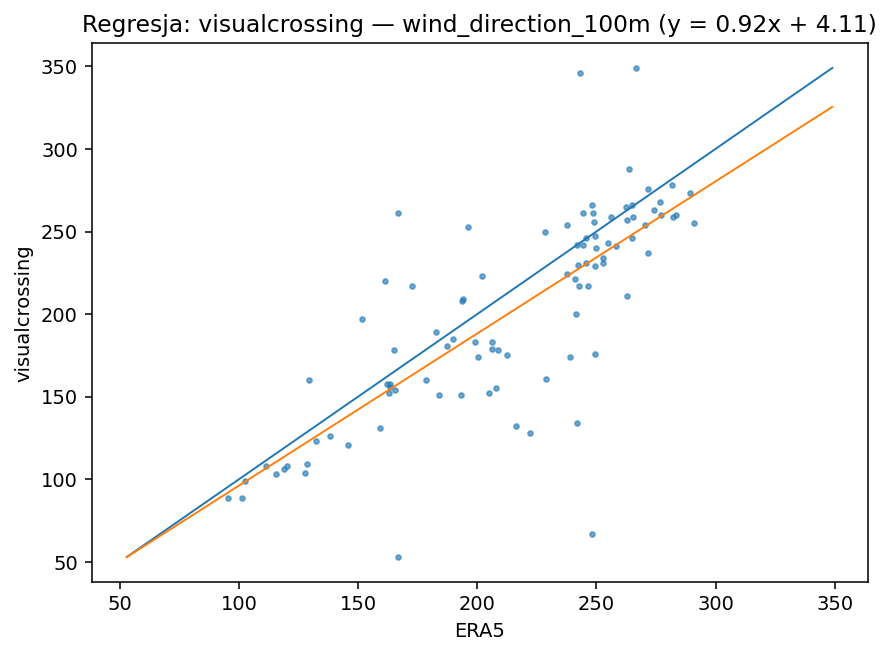
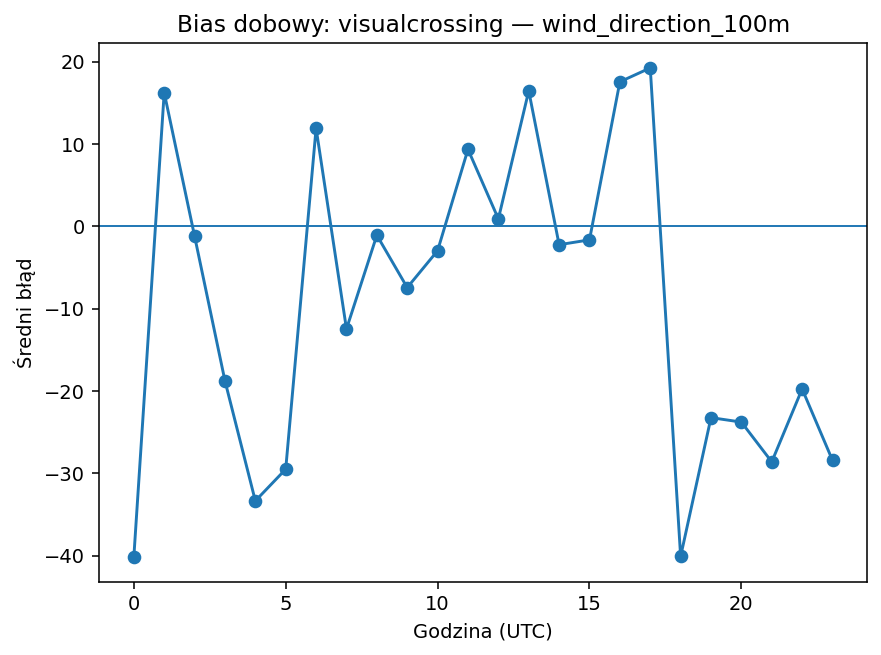
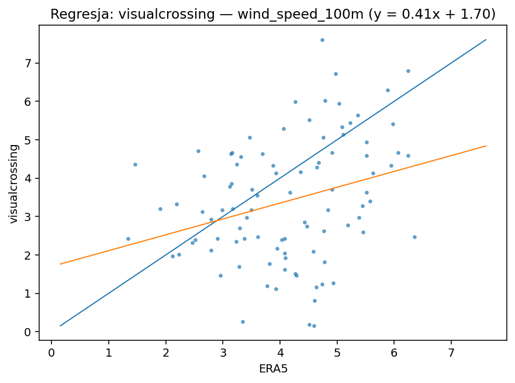
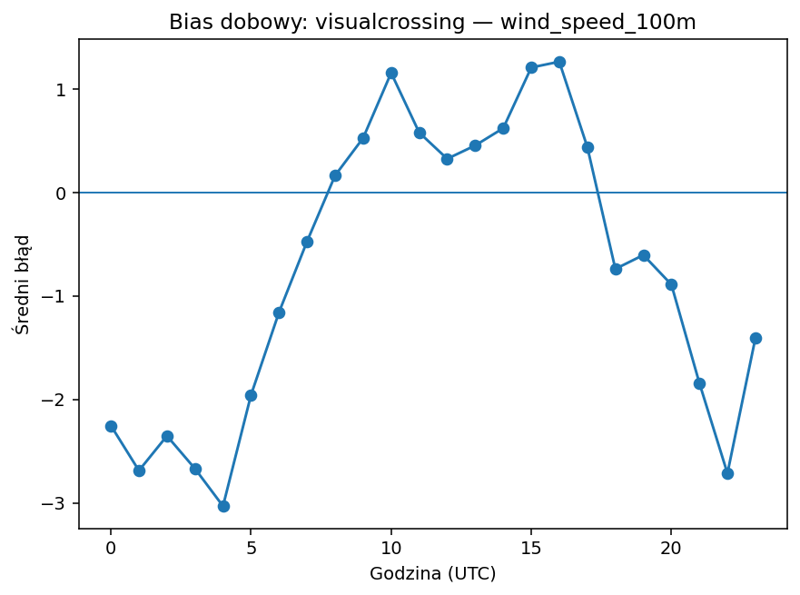

# visualcrossing

| variable | pokrycie% | dorobione% | bias | MAE | RMSE | slope | intercept | R2 | diurnal_amp | diurnal_peak_hour |
|---|---|---|---|---|---|---|---|---|---|---|
| precipitation | 100.000 | 0.000 | 0.002 | 0.002 | 0.020 | -0.144 | 0.002 | 0.000 | 0.052 | 18 |
| temperature_2m | 100.000 | 0.000 | 0.180 | 0.766 | 0.998 | 1.039 | -0.562 | 0.941 | 1.283 | 7 |
| wind_direction_100m | 100.000 | 0.000 | -8.980 | 27.927 | 41.103 | 0.921 | 4.110 | 0.600 | 59.419 | 0 |
| wind_speed_100m | 100.000 | 0.000 | -0.724 | 1.440 | 1.807 | 0.413 | 1.699 | 0.087 | 4.294 | 4 |

## precipitation

Bias +0.00 (zawyża). Skala/offset: slope=-0.14, intercept=0.00, R²=0.00. Wzorzec dobowy: amplituda 0.05, pik ok. godz. 18.

## temperature_2m

Bias +0.18 (zawyża). Skala/offset: slope=1.04, intercept=-0.56, R²=0.94. Wzorzec dobowy: amplituda 1.28, pik ok. godz. 7.

## wind_direction_100m

Bias -8.98 (zaniża). Skala/offset: slope=0.92, intercept=4.11, R²=0.60. Wzorzec dobowy: amplituda 59.42, pik ok. godz. 0.

## wind_speed_100m

Bias -0.72 (zaniża). Skala/offset: slope=0.41, intercept=1.70, R²=0.09. Wzorzec dobowy: amplituda 4.29, pik ok. godz. 4.

