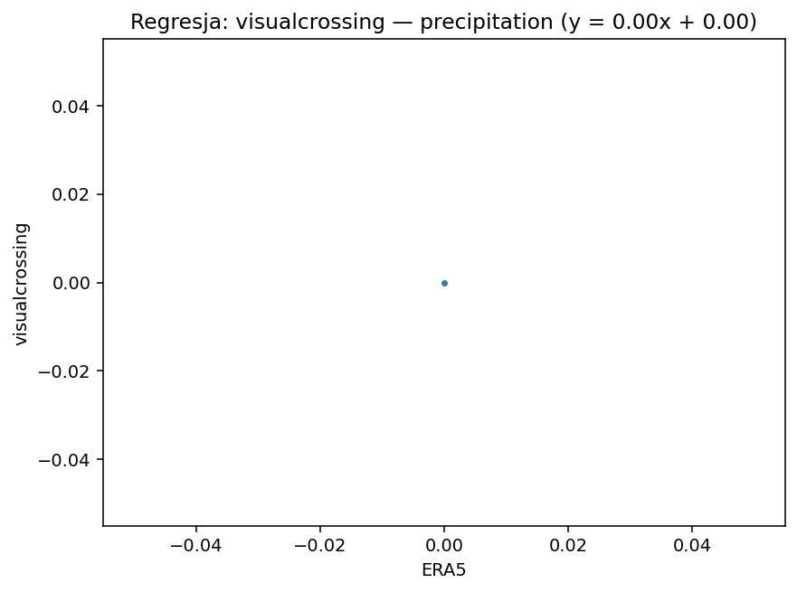
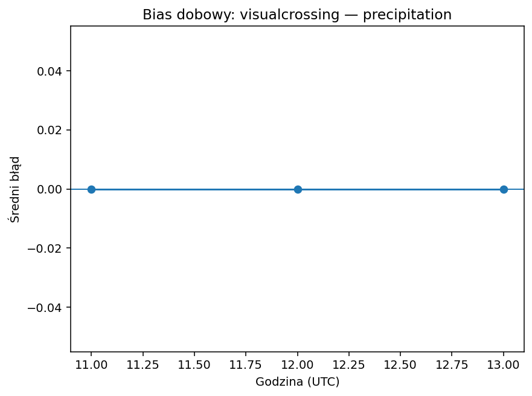
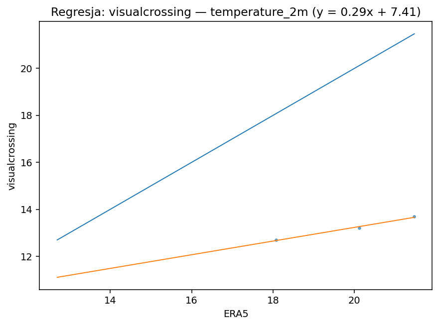
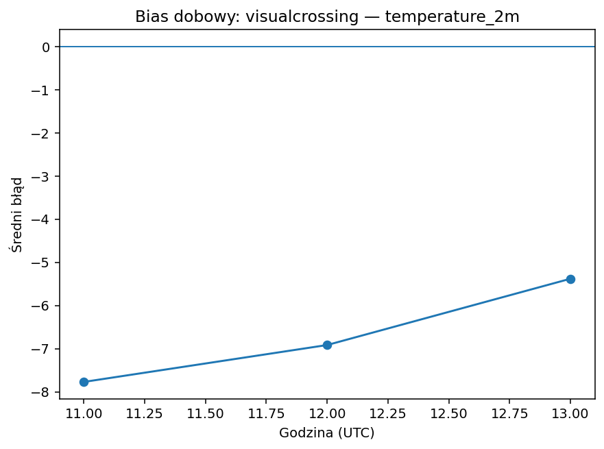
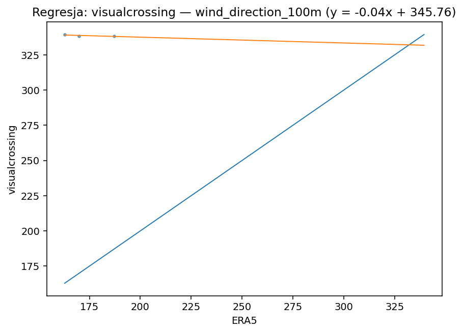
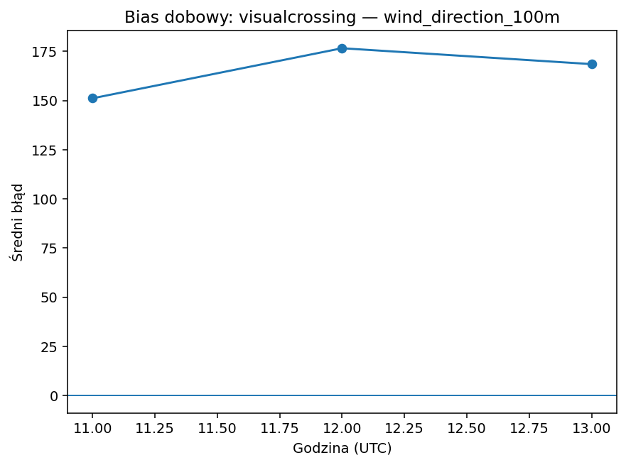
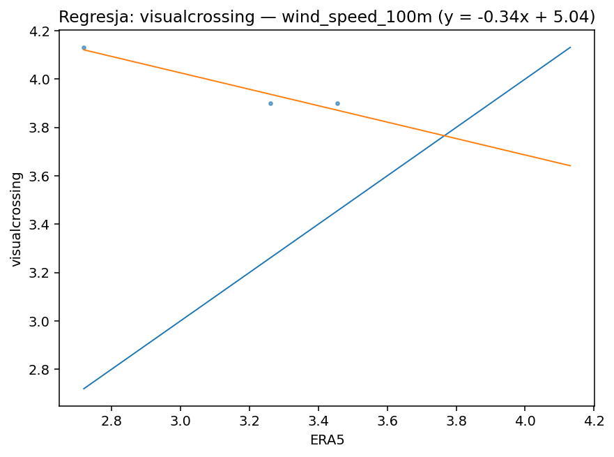
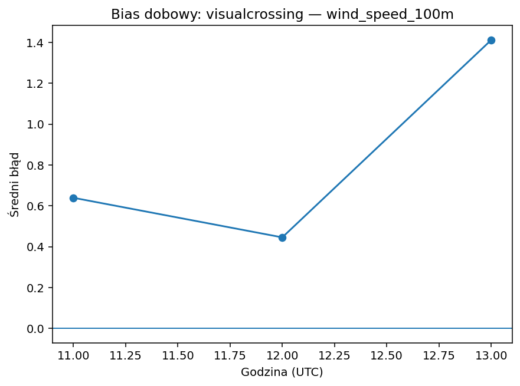

# visualcrossing

| variable | pokrycie% | dorobione% | bias | MAE | RMSE | slope | intercept | R2 | diurnal_amp | diurnal_peak_hour |
|---|---|---|---|---|---|---|---|---|---|---|
| precipitation | 100.000 | 0.000 | 0.000 | 0.000 | 0.000 | 0.000 | 0.000 | nan | 0.000 | 11 |
| temperature_2m | 100.000 | 0.000 | -6.688 | 6.688 | 6.761 | 0.291 | 7.413 | 0.987 | 2.391 | 11 |
| wind_direction_100m | 100.000 | 0.000 | 165.406 | 165.406 | 165.747 | -0.041 | 345.763 | 0.596 | 25.461 | 12 |
| wind_speed_100m | 100.000 | 0.000 | 0.832 | 0.832 | 0.931 | -0.340 | 5.044 | 0.935 | 0.967 | 13 |

## precipitation

Bias +0.00 (≈0). Skala/offset: slope=0.00, intercept=0.00, R²=nan. Wzorzec dobowy: amplituda 0.00, pik ok. godz. 11.

## temperature_2m

Bias -6.69 (zaniża). Skala/offset: slope=0.29, intercept=7.41, R²=0.99. Wzorzec dobowy: amplituda 2.39, pik ok. godz. 11.

## wind_direction_100m

Bias +165.41 (zawyża). Skala/offset: slope=-0.04, intercept=345.76, R²=0.60. Wzorzec dobowy: amplituda 25.46, pik ok. godz. 12.

## wind_speed_100m

Bias +0.83 (zawyża). Skala/offset: slope=-0.34, intercept=5.04, R²=0.94. Wzorzec dobowy: amplituda 0.97, pik ok. godz. 13.

